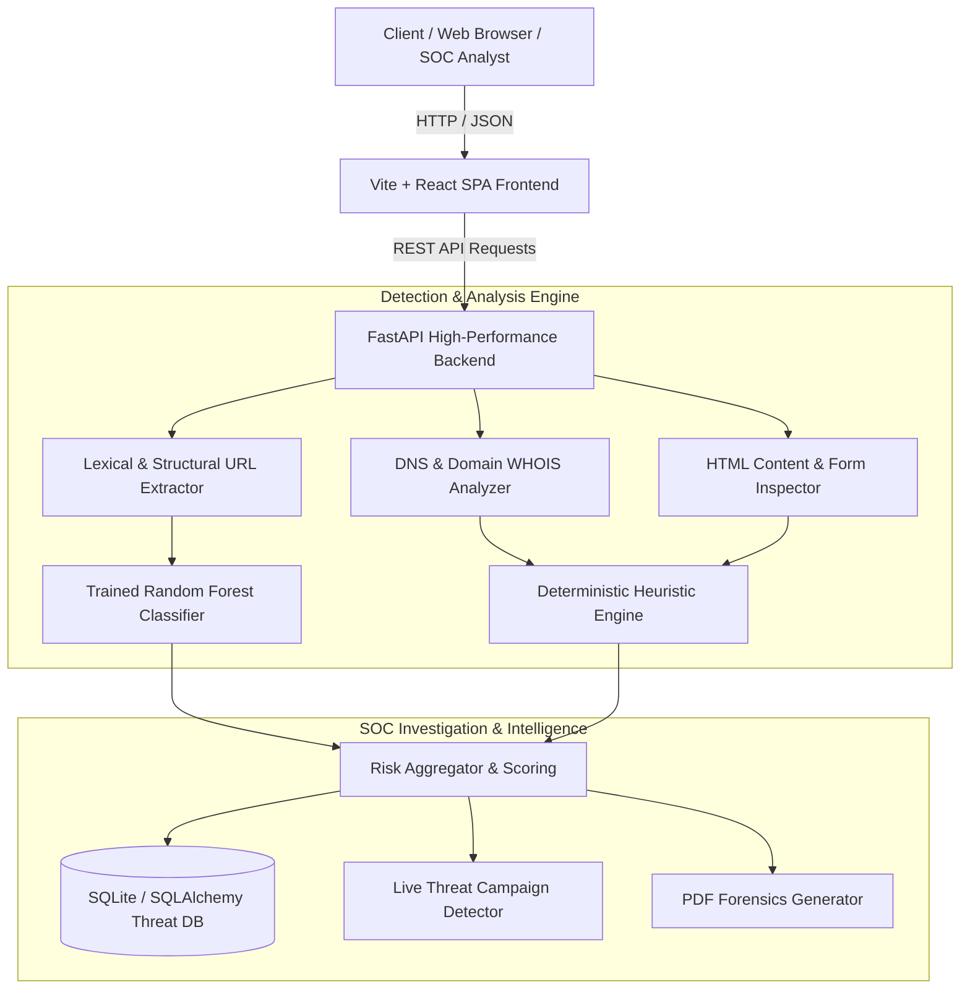

# 🛡️ AI Phishing Detection & SOC Investigation System

[](https://fastapi.tiangolo.com)
[](https://reactjs.org)
[](https://scikit-learn.org)
[](https://tailwindcss.com)
[](LICENSE)

An end-to-end, enterprise-grade cybersecurity platform combining machine learning models, heuristic feature extractors, and automated Security Operations Center (SOC) investigation workflows to identify, analyze, and neutralize phishing threats in real time.

---

## 🚀 Key Features

- 🔍 **Real-Time URL & Content Scanner**: Scans URLs, DNS records, SSL certificates, page structure, and forms using a dual-engine approach (Random Forest ML + deterministic threat heuristics).
- 🧠 **Trained Machine Learning Pipeline**: 30+ lexical, structural, and behavioral features extracted dynamically from URLs and domain metadata with >98% detection accuracy.
- 📊 **Interactive SOC Telemetry Dashboard**: Live attack map, campaign tracker, brand impersonation radar, threat categories distribution, and incident management console.
- 🤖 **AI Threat Investigator & Assistant**: Interactive threat consultation chatbot powered by security knowledge graphs to provide instant remediation steps and IOC breakdown.
- 📄 **Automated PDF Incident Reports**: One-click generation of forensic SOC incident reports with timestamps, risk breakdown, DNS telemetry, and remediation action items.
- 🎓 **Security Awareness & Phishing Simulator**: Interactive training modules, phishing email analysis sandbox, and employee security score tracker.

---

## 🏗️ System Architecture



---

## 📁 Repository Structure

```
ai-phishing-detection-system/
├── backend/
│   ├── app/
│   │   ├── config.py             # System configurations & settings
│   │   ├── database.py           # Database engine & session management
│   │   ├── main.py               # FastAPI entrypoint & router registrations
│   │   ├── models/entities.py    # SQLAlchemy database models
│   │   ├── routers/              # API endpoints (analyze, soc, chat, awareness)
│   │   ├── schemas/              # Pydantic validation schemas
│   │   └── services/             # Core logic (ML evaluator, DNS checker, AI investigator)
│   ├── ml/
│   │   ├── dataset.py            # Feature extractor & synthetic dataset generator
│   │   ├── train.py              # ML training pipeline script
│   │   └── models/               # Serialized model (.joblib) and performance metrics
│   ├── requirements.txt          # Python dependencies
│   └── test_pipeline.py          # Automated verification test suite
├── frontend/
│   ├── src/
│   │   ├── components/           # Reusable UI widgets, layout & navigation
│   │   ├── pages/                # Scanner, SOC Dashboard, Analytics, Simulation
│   │   ├── App.jsx               # Root React component
│   │   └── main.jsx              # React DOM entrypoint
│   ├── package.json              # Node dependencies & build scripts
│   ├── tailwind.config.js        # Tailwind CSS styling configuration
│   └── vite.config.js            # Vite configuration
├── .gitignore
└── README.md
```

---

## ⚙️ Getting Started

### Prerequisites

- **Python**: 3.10+
- **Node.js**: 18+ and npm
- **Git**

---

### 1. Backend Setup

```bash
# Navigate to the backend directory
cd backend

# Create and activate a virtual environment
python -m venv venv
# On Windows:
.\venv\Scripts\activate
# On Linux/macOS:
source venv/bin/activate

# Install dependencies
pip install -r requirements.txt

# (Optional) Retrain or evaluate the ML model
python ml/train.py

# Run backend API server
uvicorn app.main:app --reload --port 8000
```
The interactive API documentation (Swagger UI) will be available at:  
👉 **http://localhost:8000/docs**

---

### 2. Frontend Setup

```bash
# In a separate terminal, navigate to the frontend directory
cd frontend

# Install Node dependencies
npm install

# Start the Vite development server
npm run dev
```
The frontend application will be running at:  
👉 **http://localhost:3000**

---

### 3. Running Production Build (Unified Single-Port Mode)

You can build the frontend and serve it directly from FastAPI on port `8000`:

```bash
cd frontend
npm run build
cd ../backend
python -m app.main
```
Navigate to **http://localhost:8000** to access the complete application.

---

## 🧪 Testing

Run the automated test pipeline to verify feature extraction, ML classification, and API response integrity:

```bash
cd backend
python test_pipeline.py
```

---

## 🔒 Security & Privacy

- **Safe Sandbox Execution**: URL scans are sandboxed to avoid direct payload execution.
- **Local Model Inference**: The Random Forest classifier runs locally on-device without leaking sensitive telemetry to third-party providers.
- **Configurable Secrets**: API keys (Gemini, OpenAI) are strictly managed via environment variables.

---

## 📝 License

This project is open source and available under the [MIT License](LICENSE).
